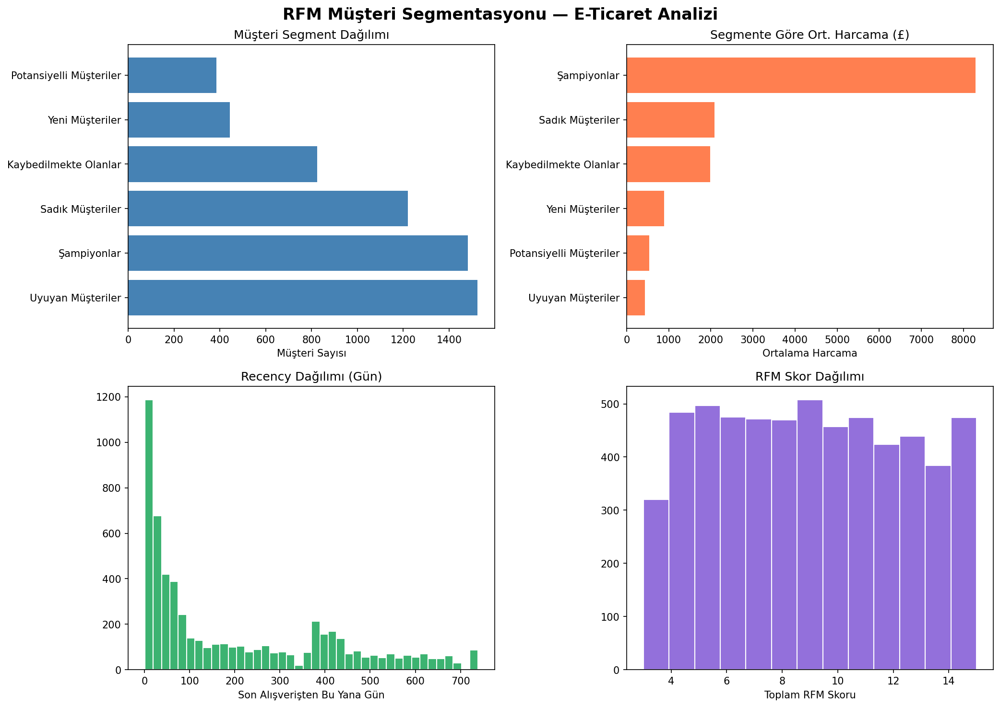

# RFM Customer Segmentation Analysis

## Project Overview
This project applies RFM (Recency, Frequency, Monetary) Analysis to an e-commerce dataset
to segment customers based on their purchasing behavior.
The goal is to identify high-value customers, at-risk customers, and new customers
to enable data-driven marketing strategies.

## Notebook
[Open in Google Colab](https://colab.research.google.com/drive/10ecrKr2Naeddno_U3Vtw1e7wNg6WfkrE?usp=sharing)

## Dataset
- **Source:** [Online Retail II Dataset - UCI / Kaggle](https://www.kaggle.com/datasets/lakshmi25npathi/online-retail-dataset)
- **Size:** 1,067,371 transactions
- **Period:** December 2009 - December 2011
- **Features:** Invoice, StockCode, Description, Quantity, InvoiceDate, Price, Customer ID, Country

## Methodology
1. **Data Cleaning** - Removed cancelled orders, null Customer IDs, and negative values
2. **RFM Calculation** - Computed Recency, Frequency, and Monetary metrics per customer
3. **Scoring** - Assigned 1-5 scores using quintile-based segmentation
4. **Segmentation** - Classified customers into 6 meaningful segments

## Customer Segments
| Segment | Description |
|---|---|
| Champions | Recent, frequent, high spenders |
| Loyal Customers | Regular buyers with good spending |
| New Customers | Recent buyers, low frequency |
| Potential Customers | Average RFM scores with growth potential |
| At Risk | Used to buy frequently but haven't recently |
| Hibernating | Low recency, frequency and monetary value |

## Key Visualizations

## Technologies Used
- **Python** - pandas, numpy, matplotlib, seaborn
- **Google Colab** - Development environment
- **GitHub** - Version control

## Business Insights
- Champions segment drives the majority of total revenue despite being a small percentage of customers
- Win-back campaigns should target the At Risk segment
- New customers need nurturing campaigns to increase purchase frequency

## Author
hilalinie | Industrial Engineering Student | Data Science Enthusiast
